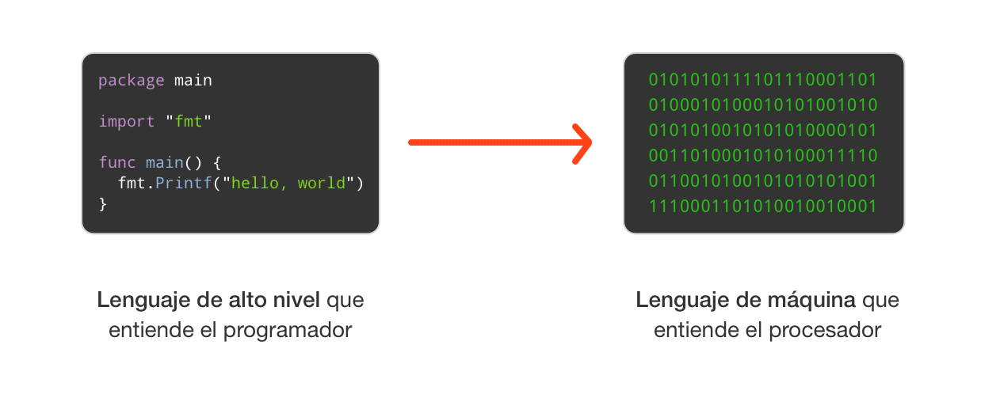
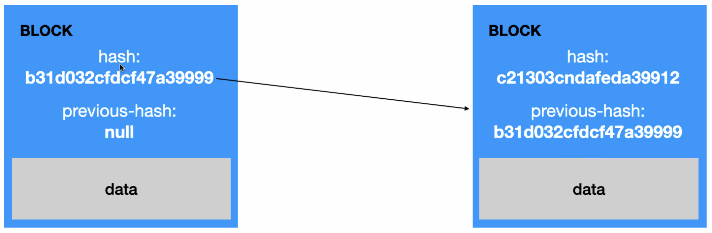
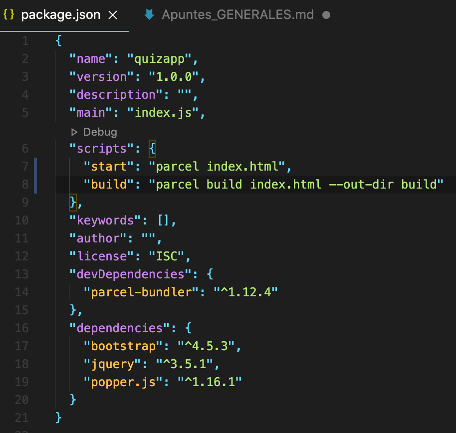

# DUDAS Y CONOCIMIENTOS GENERALES

## **Lenguajes Compilados e Interpretados**

Ambos son lenguajes que convierten lo que escribimos a lenguaje de maquina.



La principal diferencia es que el `lenguaje compilado` requiere de un paso adicional antes de ser ejecutado, **la compilacion**, que convierte el codigo que escribo en lenguaje de maquina.

Por otro lado el `lenguaje interpretado` es convertido a maquina a medida que es ejecutado.

- **Lenguajes Compilados**: Una desventaja es que es necesario el proceso de compilacion cada vez que cambias el codigo fuente.

  Otra es que debes crear ejecutables para cada tipo de sistema operativo. Uni de Linux no te valdra para Windows.

  Una ventaja es que es mas rapido. Esto se debe a que cuando es ejecutado ya se encuentra en código de máquina.

  Mejor para la maquina, peor para el programador.

  - C
  - C++
  - Go
  - Java
  - Rust

- **Lenguajes Interpretados** (son lenguajes de alto nivel): es mas rapido desarrollar con ellos, no tienes que compilar el codigo.

  Es mas lento porque requiere de conversiones para el lenguaje de maquina.

  Peor para la maquina, mejor para el programador ya que esta optimizado.

  - JavaScript
  - Python
  - Ruby

## **¿Que es programacion Orientada a Objetos? ¿Programacion Funcional? ¿Diferencias?**

Son dos paradigmas de programacion.

- **Programacion Orientada a Objetos**: el programa usa objetos para representar lo que estas programando (muchas veces objetos del mundo real)

  Los objetos guardan información interna de ellos en `atributos`. Los atributos son manipulados mediante `métodos` o `funciones` que son programados en los mismos objetos.

  - Por ejemplo: el `objeto` Persona que representa todos los datos que una persona podría tener: Peso, altura, color de pie, color de pelo, corte de pelo… Estos son los `atributos`. Entonces el objeto persona además podría hacer cosas como: leventar una caja, bajar una caja, comer, dormir, etc. Estos son las `funciones` que usan los datos que los objetos albergan.

  - Algunos de ellos son:
    - Java
    - JavaScript
    - Python
    - C++
    - C#
    - Objective-C
    - Swift

- **Programacion Funcional**: es la forma de programar que intenta evitar cambios de estados y datos cambiantes. En la programación orientada a funciones, la salida de una función siempre debería ser la misma ante entradas similares. Es un paradigma de programacion declarativa.

  - Algunos de ellos son:
    - Haskell
    - Miranda
    - Scala
    - Lisp

- **Programacion Procedural**:

## **¿Que es una API?**

El significado de API es `Application Programming Interfaces` (interfaz de programacion de aplicaciones)

[Explicacion mas detallada en Xakata](https://www.xataka.com/basics/api-que-sirve)

- Se trata de un conjunto de definiciones y protocolos que se utiliza para desarrollar e integrar el software de las aplicaciones, permitiendo la comunicación entre dos aplicaciones de software a través de un conjunto de reglas.

- Podemos hablar de una API como una especificación formal que establece cómo un módulo de un software se comunica o interactúa con otro para cumplir una o muchas funciones. Todo dependiendo de las aplicaciones que las vayan a utilizar, y de los permisos que les dé el propietario de la API a los desarrolladores de terceros.

- Nunca estan en la superficie. Son los circuitos internos que los desarrolladores ven y conectan para hacer funcionar una herramienta.

- El usuario normal solo vera los resultados.

## **¿Que es npm?**

Dentro de Node, el código se organiza por módulos o paquetes, así que al momento de trabajar con él va a ser necesario agregar más módulos, es aquí donde entra npm.

Node Package Manager o simplemente `npm` es un gestor de paquetes, el cual hará más fáciles nuestras vidas al momento de trabajar con Node, ya que gracias a él podremos tener cualquier librería disponible con solo una línea de código, npm nos ayudará a administrar nuestros módulos, distribuir paquetes y agregar dependencias de una manera sencilla.

---

## **Que es Node.js?**

Es un motor/entorno de ejecucion de JavaScript. Traduce lo que escribimos para que el ordenador entienda lo que tiene que hacer.

- <https://nodejs.org/es/about/>

- Node.js es un entorno JavaScript de lado de servidor que utiliza un modelo asíncrono y dirigido por eventos.

- Es una Máquina Virtual tremendamente rápida y de gran calidad escrita por gente como Lars Bak, uno de los mejores ingenieros del mundo especializados en VMs(Virtual Machines). No olvidemos que V8 es actualizado constantemente y es uno de los intérpretes más rápidos que puedan existir en la actualidad para cualquier lenguaje dinámico. Además las capacidades de Node.js para I/O (Entrada/Salida) son realmente ligeras y potentes, dando al desarrollador la posibilidad de utilizar a tope la I/O del sistema.

- Node soporta protocolos TCP, DNS y HTTP. Y fue creado por Ryan Dahl en 2009 y su evolución está apadrinada por la empresa Joyent que además tiene contratado a Dahl.

- Uno de los puntos fuertes de Node.js es su capacidad de mantener muchas conexiones abiertas y esperando. En Apache por ejemplo el parámetro MaxClients por defecto es 256. Este valor puede ser aumentado para servir contenido estático, sin embargo si se sirven aplicaciones web dinámicas en PHP u otro lenguaje es probable que al poner un valor alto el servidor se quede bloqueado ante muchas conexiones esto dependerá del trabajo que la aplicación web de lado del servidor y de su capacidad hardware.

---

## **Taller de introducciona JavaScript - Crea tu propia criptomoneda**

---

[AQUI esta el enlace al Video del taller](https://zoom.us/rec/play/LsEwXzOLTKTEB4eNxXnHMUcHyNwlvzUvSIH-_O-6OKbCpgCihcLIVY6opAbWmSPsup2TbIBm4KBY2UZ5.rjKM4rGqZ2LYZwWG?continueMode=true&utm_medium=email&_hsmi=99785705&_hsenc=p2ANqtz-8768dVcOJdKfCC2CPeY-YHcvemKApv4S4UsYElmG4tmdbVw4J8ee_UQH1wCF-EKzQ7J84Vx7fC6rOKGCDnIeCoF-ouZTdC-IYPQ8yeBtEVWCyaDi4&utm_content=99785705&utm_source=hs_email)

- Distintas RRSS
  - Youtube: 10 minutos programando
  - linkedin: mariogiron
  - twitter: m_giron

### **Blockchain**

Cadena de bloques que estan encadenados entre si. Estos bloques almacenan informacion. Se puede enfocar a criptomonedas pero tambien para muchas otras cosas.



Son cadenas de datos, en las que cada una esta referenciada con un ID o "hash" unico. Este hash se crea con la encriptacion de los datos que contiene.  
Tambien algo muy importante es que cada Block hace referencia a un "previous-hash" que referencia al hash del bloque anterior.

- Programacion orientada a objetos: es programacion, un paradigma que intenta crrar cosas que existen en la vida real, a codigo. Acciones, etc  
  Importancia del metodo constructor.

- <https://repl.it> : una pagina para instalar librerias y mas cosas. Crea entorno de desarrollo.

# Conceptos

- Poner en produccion una app significa ponerla ya en servicio de quien quiera

  - Se hace con el npm run start y con npm run build

  

- ¿Que es y para qué sirve un archivo `*.json`?: [Link](https://www.json.org/json-en.html)

  - Las siglas significan `JavaScript Object Notation` (notacion de objetos JavaScript).

  - Es un formato ligero de intercambio de datos, sencillo de leer y escribir para los programadores y simple de interpretar y generar para las máquinas.

  - Dicen que es una alternativa a XML.

  - Es un formato de texto totalmente independiente de cualquier lenguaje, pero utiliza convenciones de ellos.

  - Define seis tipos de valores: null, number, string, boolean, array y objects”.

- No usar nunca servidor en tu casa, permite ver la red de tu casa.

## **5 Principios de la programacion (SOLID)**

- El tamaño de una funcion no puede se rmayor de unas 20 Lineas

- Las funciones solo deben hacer una unica cosa, no deben utilizarse para mas. Tener en cuenta el SRP (**Single Responsibility Principle**)

1. **Single Responsibility Principle (SRP)**

   - Las funciones solo deben hacer una unica cosa, no deben utilizarse para mas.

2. **Open/Closed Principle**

3. **Liskov Substitution Principle**

4. **Interface Segregation Principle**

5. **Dependency Inversion Principle**

## Recursividad

- Son funciones que se llaman a si mismas para ser utilizadas. Por ejemplo esto puede pasar al realizar ejercicios como:

  - Calcular el Fibonacci de un numero

  - Saber el factorial de un numero

    ```js
    function factorial(n) {
      if (n === 0) {
        return 1;
      } else {
        return n * factorial(n - 1);
      }
    }
    ```
