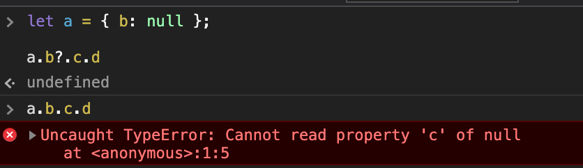
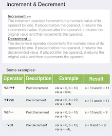
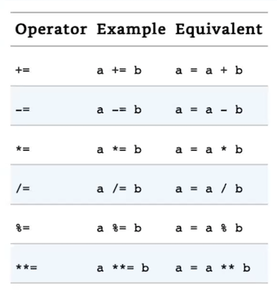

# APUNTES DE JAVASCRIPT **Clase1**

## Normas Lexicas

- Existe distincion entre MAYUS y minusculas

- La manera de marcar un comentario es la siguiente --> `/**/`

- por convencion las declaraciones de variables usaremos la convencion camel case--> `const camelCase = "camel case"`

- para constantes usaremos Mayusculas y guion bajo

- Hay palabras reservadas en Javascript:

  - `await break case catch class const continue debugger default delete do else export extends finally for function if import in instance of new return super switch this throw try typeof let void while with yield`
  - y unas nuevas para futuro: `enum implements interface package private protected public`

- usaremos el semicolom `;` para que quede bonito

## VARIABLES

---

Hay dos tipos en Javascript: primitivos y objetos

- Primitivos: `numeros`, `string` y `booleans`. Tambien se considera `null` y `undefined`, pero son especiales. Los primitivos son **INMUTABLES** (no hay manera de cambiar su valor)

- Luego tendremos los Objects: todo lo que no sea un primitivo es un objeto. Son **MUTABLES**

- Se les llama tipos referenciales.

  - Objetos fundamentados `{}`
  - Array `[]`
  - `symbol`
  - Funciones
  - etc

## **Tipos de Variables**

---

- `const` : no se puede variar (constantes) no muta. Una buena practia es declararlas con MAYUS para diferenciar.
- `let` : puede variarse (Usaremos esta para el curso)

  - Es una variable de bloque. Es decir, que puede ser llamada solo en el lugar donde estan declaradas. Va por niveles. P.ej si declaro dentro de una funcion, solo la puedo llamar dentro de esta, sin embargo si esta declarada fuera de la funcion, podre llamarla en la funcion y fuera de ella.

- `var`: PROHIBIDO. Puedes declarar un avariable con el mismo nombre varias veces y se sobre escribe, cosa que con `let`y `const` no pasa, ya que te daria un error.

  Otra caracteristica es que se declara de manera global. No de manera local, dentro de una funcion o estamento como pasa con let y const.

  - Se pueden designar varias variables en un mismo `Let/Const/Var` separando por comas:

    ```js
    //ejemplo1

    let i,
      n,
      j = 23;

    //ó

    let i = 1,
      n = 4,
      j = 6;

    //aunque solo tienen sentido en los for

    for (let i = 0, j = 10; i < j; i++, j++) {
      console.log(i + j);
    }
    //esto va sumando todos y va dandote todos los numeros NO HACER
    ```

- la variable se declara con sel simbolo `=` que significa **ASIGNACION** no igualdad.

- esto es un objeto con propiedad: propiedad:valor

      const o = {x : 1}

- Si declaramos una variable asi, lo estamos metiendo en el objeto global. Tampoco lo vamos a usar.

      x = 1

### **Tipo NUMBER**

Pueden ser numeros eneteros, decimales negativos o como queramos. Cuantos mas decimales mas le costará gestionarlo.

Asignar variables:

```js
let x = 87;

console.log(x);
87;

//Cambio de variable

x = 50;

console.log(x);
50;
```

### **Tipo TEXTO (String)**

- Son INMUTABLES
- Son como array de caracteres
- Hay dos formas de definir un string

  - Comillas simples `"string"`
  - Comillas simples ``string`

- los string son inmutables, no se cambian
- el primer caracter de un string es el 0

- dentro de un string podemos escapar cosas usando back slash `\`. salto de linea por:

      console.log("hola \"mundo\"")
      hola "mundo"
      console.log("hola \\")
      hola \

  Aqui dejo mas usos:

  

- Template string `$ {}` y se encierra entre ``.

  Todo lo que se escriba entre cada ${} aqui ${}, se vera representado en la consola. En este ejemplo al haber espacios, saldra separado por espacios.

  ```js
  const name = "Alejandro";
  const firstQuote = "Mi nombre es";
  const lastQuote = "¿como estas?";

  console.log(firstQuote + " " + name + " " + lastQuote);

  // Esto es template string

  console.log(`${firstQuote} ${name} ${lastQuote}`);

  //esto imprime--> Mi nombre es Alejandro ¿como estas?
  ```

- REVISAR mas cosas sobre `RegEx`!!!

  [Pagina regex101](https://regex101.com)

  [Video de youtube de Regex](https://www.youtube.com/watch?v=rhzKDrUiJVk&t=615s)

### **Tipo BOOLEAN**

- Solo existen dos tipos literales.

  - `True`
  - `False`

NOTA: cualquier valor en JavaScript puede ser convertido en valor Booleano.

- 6 valores que funcionan como `False` de por si:

  `False`

  `undefined`

  `("") string vacio`

  `null`

  `NaN`

  `0`

- Si queremos saber que valor booleano es algo, escribiremos delante de el `!!`
- Hay 3 operadores booleanos importantes:

  - `&&` --> and
  - `||` --> or
  - `!` --> not

        - si `true` && `true`--> `true`
        - si `true` && `false`--> `false`
        - si `false` && `true`--> `false`
        - si `false` && `false`--> `false`

        - si `true` || `true`--> `true`
        - si `true` || `false`--> `true`
        - si `false` || `true`--> `true`
        - si `false` || `false`--> `false`

- El resto d evalores, numeros, string, array son `True`

- `Null`: es la ausencia de valor o ausencia de objeto. Tecnicamente es el unico miembro de su tipo.

- `undefined`: es ausencia de valor tambien, pero mas especial. Lo retorna cuando no se ha definido algo. Es el valor de

- Usaremos `==` para comparar los `null`y los `undefined`
  Para el resto de comparaciones usaremos `===` ¡¡¡IMPORTANTE!!!

  - `==` --> Igualdad en contenido
  - `===` --> Igualdad en tipo variable y contenido.
  - `=` --> Hace referencia a una asignacion, NO a una igualdad o comparacion

### **Tipo Lista o ARRAY [ ]**

- Construccion de array. es una lista de expresiones separadas por coma, entre corchetes. `const array =[1, 2, 3 * 2, "foo"]`

  - Los arrays pueden tener mas arrays anidados, es decir como expresiones dento de el: (matrices)

  ```js
  const matrix = [
    [1, 2, 3],
    [4, 5, 6],
    [7, 8, 9],
    [[10, 11, 12], 13, 14],
  ];

  arr[3]; // equals [[10,11,12], 13, 14]
  arr[3][0]; // equals [10,11,12]
  arr[3][0][1]; // equals 11
  ```

- Se pueden meter elementos undefinde, los llamados elementos dispersos.

```js
  const parseArr = [1, , , ,5];

  parseArr
  (5) [1, empty × 3, 5]
```

- En las listas Array el primer elemento del mismo siempre es el `0`. Esto se llama _zero-indexed_.

- No se pueden sumar ni restar ni multiplicar. Para hacerlo hay que llamar a los elementos que se encuentran dentro de esta de manera especifica.

- No estan ordenados

- la propiedad `.length` nos indica el numero de elementos que tiene.

- el ultimo elemento de una lista es el elemento `lista[lista.length-1]`

- Hay operaciones ya programadas para los array que se llaman `Metodos`

  ```js
  <script>
    let nombre = "frabcesc"; let macedonia = ["poma", "pera", "33", nombre,
    true, , "barcelona"]; //primer elemento console.log(macedonia[0]);
    //devuelve poma //segundo elemento console.log(macedonia[1]); //devuelve
    pera //ultimo elemento console.log(macedonia[6]); //devuelve barcelona
    console.log(macedonia.length); //devuelve el valor 7
    console.log(macedonia[macedonia.length - 1]); //devuelve barcelona
  </script>
  ```

- Uno de los metodos para trabajar con los array es `.push()`. Pushea uno o varios elementos dentro de un array, siempre posicionandolo a la derecha:

  ```js
  let myArray = [
    ["John", 23],
    ["cat", 2],
  ];

  myArray.push(["dog", 3]);

  //Ahora es
  let myArray = [
    ["John", 23],
    ["cat", 2],
    ["dog", 3],
  ];
  ```

- Lo contrario de .push es el metodo `.unshift()`. Pushea un elemento en el primer lugar de un array.

- Otro metodo es `.pop()`. Elimina el ultimo elemento de un array. Puedes meterlo en una nueva variable

  ```js
  let threeArr = [1, 4, 6];
  let oneDown = threeArr.pop();
  console.log(oneDown); // Returns 6
  console.log(threeArr); // Returns [1, 4]
  ```

- Otro metodo es `.shift()`. Elimina el primer elemento de un array. Puedes meterlo en una nueva variable

## **OBJETOS**

---

Son similares a los arrays, pero en vez de tener indices tienen propiedades.

Es una coleccion no ordenada de propiedades.

- Las propiedades de un objetos son 3.

  - Escribible
  - Numerable
  - Configurable

- Los objetos sirven para modelar el mundo real.

```js
const arr = [1, 2, 3, -1.2];
const p = { x: 2.3, y: arr[3] };
const q = {};

q.x = 2.3;
q.y = -1.2;
```

- por ejemplo en este caso modelamos un rectangulo

```js
const rectangle = {
  upperLeft: { x: 2, y: 2 },
  lowerRight: { x: 4, y: 4 },
};
```

- O por ejemplo el objeto "cat":

```js
let cat = {
  name: "Whiskers",
  legs: 4,
  tails: 1,
  enemies: ["Water", "Dogs"],
};
```

- Se puede saber los valores de los objetos con notaciones de `.`(puntos) y `[]`(corchetes):

  Los corchetes, evaluan un `string` o algo que pueda ser convertido a string.

  ```js
  let myDog = {
  name: "Guachi",
  legs: 4,
  tails: 1,
  friends: ["Alex", "Mario"]
  };
  //En consola:
  myDog
  {name: "Guachi", legs: 4, tails: 1, friends: Array(2)}

  myDog.name
  "Guachi"
  myDog.friends[0]
  "Alex"
  myDog.friends[1]
  "Mario"

  //mas ejemplos de corchetes []
  let myObj = {
    "Space Name": "Kirk",
    "More Space": "Spock",
    NoSpace: "USS Enterprise"
  };
  myObj["Space Name"]; // Kirk
  myObj['More Space']; // Spock
  myObj["NoSpace"];    // USS Enterprise
  ```

- Hay mas maneras de saber los valores de Object y tambien las propiedades con:

  - `Object.keys(x)`

    ```js
    const o = { x: 1, y: 2 };

    Object.values(o)(2)[(1, 2)];
    ```

  - `Object.values(x)`

    ```js
    const o = { x: 1, y: 2 };

    Object.keys(o)(2)[("x", "y")];
    ```

- Se puede cambiar el valor de cualquier propiedad del objeto en culquier momento, usando los simbolos de asignacion `=` y llamando a las propiedades igual que lo hacemos para ver su valor.

- Tambien podemos **añadir**/**modificar** mas propiedades cuando queramos, de la misma manera que llamamos a las propiedades y asignamos un valor:

  ```js
  let myDog = {
  name: "Guachi",
  legs: 4,
  tails: 1,
  friends: ["Alex", "Mario"]
  };

  //en consola:
  myDog.age = 14
  //o
  myDog["age"] = 14
  14

  myDog
  {name: "Guachi", legs: 4, tails: 1, friends: Array(2), age: 14}

  myDog.tails = 5

   myDog
  {name: "Guachi", legs: 4, tails: 5, friends: Array(2), age: 14}

  ```

- Se pueden eliminar propiedades con la siguiente expresion --> `delete objeto.propiedad` o `delete objeto["propiedad"]`. NUNCA USAR. Mejor convertir a `null`.

- Algunos metodos de `Objetos`:

  - `objeto.hasOwnProperty(propname)`: Para saber si una propiedad esta contenida dentro de ese objeto.

- Hay veces al llamar a objetos que podria petar, ya que buscamos una propiedad en otra que ya ha llegado al null o undefined. Al estar estas vacias nos devolvera un error. Tenemos que aprender a evitar esto, ya sea con condicionales, con cortocircuitos etc.:

  ```js
  const book = {
    "sub title": "foo",
  };

  book.subtitle.length; //esto devuelve error.

  //varias maneras de parar esto y nos devuelva undefined:

  if (book != null) {
    if (book.subtitle != null) {
      console.log(book.subtitle.length);
    }
  }
  //ó podremos usar cortocircuito:
  const length = boook && book.subtitle && book.subtitle.lenght;

  //o en ES6 se añadio otra manera--> chain operator:
  const es2020Length = book?.subtitle?.length;
  ```

## **Prototypes**

---

[Herencia y la cadena de prototipos](https://developer.mozilla.org/es/docs/Web/JavaScript/Herencia_y_la_cadena_de_protipos)

[Introducción a JavaScript orientado a objetos](https://developer.mozilla.org/es/docs/Web/JavaScript/Introducción_a_JavaScript_orientado_a_objetos)

- Los `prototype` son los objetos de donde heredan las propiedades otros objetos.

  Todos los objetos tienen un prototipo, pero solo un numero limitado de objetos, tienen la propiedad prototype. Son estos objetos los que tienen la propiedad prototype, los que definen las propiedades de los objetos. Es decir, los que no tienen prototype, lo heredan de estos que sí.

  - `Object.prototype` es el unico objeto que no hereda nada de nadie. Es el objeto primigenio desde el que todos los objetos heredan propiedades.

  - `Function.prototype`
  - `Array.prototype`
  - `Date.protptype`

- El operador `new`: crea e inicializa un nuevo objeto. (Es lo mismo que inicializarlo de manera normal !!):

  ```js
  const o = new Object();
  //{}
  //Del cual heredan los metodos los Objetos

  const d = new Date();
  //Tue Dec 15 2020 20:50:35 GMT+0100 (hora estándar de Europa central)
  //Del cual heredan los metodos las fechas

  const a = new Array();
  //[]
  //Del cual heredan los metodos los Arrays

  const m = new Map();
  //Map(0) {}
  ```

  En este caso los inicializa con las caracteristicas de esos objetos(Objet, Date, Map, Array etc)

- Luego esta la manera de crear un objeto solo dandole un prototipo `Object.create()`:

  ```js
  const o1 = Object.create({ x: 1, y: 2 });
  ```

  OJO: si hacemos referencia a otra constante, coge el prototipo y hereda las propiedades.HEREDA OJO, que no contiene. Ese objeto estara vacio, pero si preguntamos por una de sus propiedades de las que hereda, te dara el valor.

  ```js
  let animal = { reino: "no humano" };
  undefined;
  let perro = Object.create(animal);
  undefined;
  perro;
  //{};
  animal;
  //{reino: "no humano"}
  //pero si llamamos a una propiedad...
  perro.reino;
  //"no humano"
  ```

  ```js
  let cosa = Object.create({ x: 1, y: 2 });
  //undefined
  cosa;
  //{}
  ```

  Un ejemplo claro de como funciona `Object.create` seria el siguiente:

  ```js
  let a = { a: 1 };
  // a ---> Object.prototype ---> null

  let b = Object.create(a);
  // b ---> a ---> Object.prototype ---> null
  console.log(b.a); // 1 (heredado)

  let c = Object.create(b);
  // c ---> b ---> a ---> Object.prototype ---> null

  let d = Object.create(null);
  // d ---> null
  console.log(d.hasOwnProperty);
  // undefined, por que d no hereda de Object.prototype
  ```

  ¿Que pasaria si queremos crear un objeto vacio? No podemos pasarle el `Object.create(null)`ya que crea algo plano sin propiedades. Tendriamos que hacerlo asi:

  ```js
  const x = Object.create(Object.prototype);
  //ó

  const y = Object.create({});
  ```

- Metodos `JSON.stringify` y `JSON.parse` (serializar): es para convertir un objeto en string y convertir un string a objeto respectivamente.

  OJO: puede ser muy util para comparar objetos y ver si son iguales(ya que de normal no se pueden comparar)

- Podemos meter funciones dentro de objetos(INVESTIGAR).

```js
const square = {
  side: 10,
  area() {
    return this.side * this.side;
  },
};
```

- El metodo `this.` es un metodo para llamar una propiedad de un objeto dentro de ese mismo objeto.

  Hace referencia a la propiedad del objeto en el que se encuentra.

  Se refiere al `Objeto` en el que se encuentra.**IMP!**

  _JavaScript tiene una palabra clave especial, `this`, que puedes usar dentro de un método para referirte al objeto actual. Por ejemplo, supongamos que tienes 2 objetos,Manager e Intern. Cada objeto tiene su propio name,age y job. En la función sayHi(), observa que hay this.name. Cuando se agregan a los 2 objetos, se pueden llamar y devuelve el 'Hola, mi nombre es' y luego agrega el valor name de ese objeto específico. Como se muestra abajo._

  ```js
  const Manager = {
    name: "John",
    age: 27,
    job: "Software Engineer",
  };

  const Intern = {
    name: "Ben",
    age: 21,
    job: "Software Engineer Intern",
  };

  function sayHi() {
    console.log("Hola, mi nombre es ", this.name);
  }

  // agrega la función sayHi a ambos objetos
  Manager.sayHi = sayHi; //Se hacer referencia a la funcion SIN los Parentesis!
  Intern.sayHi = sayHi;

  Manager.sayHi(); // Hola, mi nombre es John'
  Intern.sayHi(); // Hola, mi nombre es Ben
  ```

- `Metodo`: Es una funcion asociada a un objeto. Tambien puede decirse que es una propiedad de un objeto, que es una funcion.

- Hay `2` maneras de añadir funciones a objetos:

  ```js
  let myObj = {
    myMethod: function(params) {
      // ...hacer algo
    }
    // ó
    myOtherMethod(params) {
      // ...hacer algo más
    }
  };
  ```

- Captadores (`getters`) y establecedores (`setters`)

  - Un captador (`get`) es un método que **obtiene** el valor de una propiedad específica.

    El metodo captador NO espera ningun parametro.

  - Un establecedor (`set`) es un método que **establece** el valor de una propiedad específica.

    El metodo establecedor SI lleva un parametro.

  Ejemplo de uso:

  ```js
  var o = {
    a: 7,
    get b() {
      return this.a + 1;
    },
    set c(x) {
      this.a = x / 2;
    },
  };

  console.log(o.a); // 7
  console.log(o.b); // 8 <-- En este punto se inicia el método get b().
  o.c = 50; // <-- En este punto se inicia el método set c(x)
  console.log(o.a); // 25
  ```

### **CLASES** (INVESTIGAR)

En Javascript no existen las clases. Son azucar sintactico.(INVESTIGAR minuto19:15)

```js
class ShoppingCart {
};
const shoppingCart = new ShoppingCart() {
};

```

- Funcion Constructora:(INVESTIGAR)

  - Suele empezar en letra Mayuscula por convencion.

```js
function Car(make, model, year) {
  this.make = make;
  this.model = model;
  this.year = year;
}

let mycar = new Car("Eagle", "Talon TSi", 1993);
```

- ¿Que es instanciar(crear una instancia)?(INVESTIGAR)

## **Herencia**

---

- En Javascript no existen las clases. Si existe la palabra `class` pero solo sirve como azucar sintactico, para endulzar a los desarrolladores que venian de otros lenguajes.

  Lo que podemos referir como herencia en Javascript es a la cadena de prototipos. Cada objeto tiene una propiedad privada (llamada `Prototype`) que mantiene un enlace a otro objeto llamado `Prototipo`. Ese objeto tiene su prototipo y asi sucesivamente hasta llegar a uno cuyo objet oprototipo es `null`. Ahi acaba la cadena.

  [Herencia y la cadena de prototipos](https://developer.mozilla.org/es/docs/Web/JavaScript/Herencia_y_la_cadena_de_protipos)

  Se puede acceder a la propiedad de un objeto del cual heredas.

- Un ejemplo muy claro de como funcionan las cadenas de prototipos y por que hay veces que nos devuelve indefined. Es cuando llega al tope y no encuentra el valor, solo null, entonces devuelve undefined:

  ```js
  // Supongamos que tenemos un objeto o, con propiedades a y b:
  // {a: 1, b: 2}
  // o.[[Prototype]] tiene propiedades b y c:
  // {b: 3, c: 4}
  // Finalmente, o.[[Prototype]].[[Prototype]] es null.
  // Este es el final de la cadena de prototipos, ya que null,
  // por definición, no tiene [[Prototype]].
  // Por tanto, la cadena completa de prototipos se vería como:
  // {a:1, b:2} ---> {b:3, c:4} ---> null

  console.log(o.a); // 1
  // ¿Hay una propiedad 'a' en o? Sí, y su valor es 1.

  console.log(o.b); // 2
  // ¿Hay una propiedad 'b' en o? Sí, y su valor es 2.
  // El prototipo también tiene una propiedad 'b', pero no se ha visitado.
  // Esto se llama "solapamiento de propiedades"

  console.log(o.c); // 4
  // ¿Hay una propiedad 'c' en o? No, comprobamos su prototipo.
  // ¿Hay una propiedad 'c' en o.[[Prototype]]? Sí, y su valor es 4.

  console.log(o.d); // undefined
  // ¿Hay una propiedad 'd' en o? No, comprobamos su prototipo.
  //  ¿Hay una propiedad 'd' en o.[[Prototype]]? No, comprobamos su prototipo.
  // o.[[Prototype]].[[Prototype]] es null, paramos de buscar.
  // No se encontró la propiedad, se devuelve undefined
  ```

## **FUNCIONES**

- Una funcion se escribe con la palabra `function` seguida de una lista separada por comas (`,`) de 0 o mas identificadores/parametros/argumentos entre parentesis.Ademas dentro de llaves `{}` el cuerpo d ela funcion.

```js
const square = function (x) {
  return x * x;
};
```

Funciones de flecha gorda o fat arrow function: (`=>`):

```js
const sum10 = (x) => sum(10, x);

sum10(5);
15;
```

- Un ejemplo de funcion:

```js
const sum = function (x, y) {
  return x + y;
};

//con fat arrows

const sum = (x, y) => x + y;

//acaba

const suma5 = function (x) {
  return sum(5, x);
};

suma5(7); //--> 12
```

- Tres maneras de escribir la misma funcion:

  ```js
  //1
  const sum = function (x, y) {
    return x + y;
  };
  //2
  function sum(x, y) {
    return x + y;
  }
  //3
  const sum = (x, y) => x + y;
  ```

- Las variables creadas dentro de una funcion tendran un _scope_ Local en vez de Global.

  Si declaramos un avariable con un mismo nombre que una fuera de la funcion, dentro d ela funcion, tomara el valor de dentro de la funcion.

## **Expresiones**

- Las expresiones son frases, que son evaluadas para producir un valor.

- Acceder a una propiedad con `[]` ó `{}`

```js
/*
maneras de acceder a una propiedad:

expresion.identificador
expresion[expresion]
*/

const o = {x: 1, y: { z: 3 }}
const a = [o, 4, [5, 6]];


o.x; => 1
o.y.z; => 3
o["x"]; => 1
a[1]; => 4
a[2][1]; => 6
a[0].x; => 1
```

```js
const arr2 = ["a", "b", "c", "d"];
undefined;
//entiende la posicion 2 ya sea number o string
arr2[2];
("c");

arr2["2"];
("c");
```

## Conversion Primitiva

Es una tarea muy comun el convertir de tipos dentro de la programacion

```js
string(2); //convierte a string
("2");

const x = 1; //convierte a string

x + "";
("1");

const x = "1"; //convierte a numero
+x;
1;

!!x; //convierte a booleano
true;

!x; //convierte a booleano
false;

Bollean(x); //convierte a booleano
true;
```

- `Objetos`: Todo objeto convierte a `true`

- Suma convierte a string: `1 + "2" => "12"`

- Multiplicacion convierte a numero: `1 * "2" => 2`

- `"3" < "5" => true ` tambien convierte a numeros, los reconoce como.

---

## Acceso condicional ()

- Sirve para si hacemos un loop o algo, consulta las propiedades segun le indiquemos y si alguno de null, antes de que pete y nos devuelva error, para, y nos devuelve undefined.

- Si no puede accederm lo demas lo evalua como undefined.

- Se usa normalmente con objetos

```js
/*
expresion ?.identificador
expresion ?.[expresion]
*/

let a = { b: null };

a.b?.c.d;
```



## **Objeto global**

- es un objeto fundamental
- las propiedades de este sirven como propiedades globales
- undefined es una propiedad del objeto global

## **Symbol**

- Pueden ser propiedades de objetos

---

## **Operadores**

- Los operadore spueden cambiar el tipo de sus operandos.

- Operadores aritmeticos:

  ```js
  2 ** 3; //exponencial
  2 * 3; //multiplicacion
  5 / 2; //division
  10 % 5; //modulo
  2 + 2; //suma
  2 - 2; //resta
  ```

  Excepto la suma, que si suma con numero String convierte a string, todos los demas convierten a number.

- Todos los operadores van de izquierda a derecha, EXCEPTO el exponencial (`**`) que trabaja de derecha a izquierda. NOTA: si hay un operador negativo, JS nos obliga a ponerlo entre parentesis.

  ```js
  (-3) ** 2;
  SyntaxError(-3) ** 2;
  9 - 3 ** 2 - 9;
  ```

- La suma:

  - Si sumamos string:

    ```js
    "1" + "2";
    ("12");

    "1" + 2;
    ("12");
    ```

  - Si sumamos `true` o `false`:

    ```js
    //sabemos que true = 1 y false = 0

    true + true;
    2;

    true + false;
    1;

    2 + false;
    2;

    2 + true;
    3;
    ```

  - Operaciones extraños

    ```js
    1 + "2 + hello world";
    ("12 + hello world");
    ```

  - Incremento:

    Pre-incrementando `++i`

    ```js
    let i = 1;

    let j = ++i;

    i;
    2;

    j;
    2;
    ```

    Post-incrementando `i++`

    ```js
    let m = 1;

    let n = m++;

    m;
    2;

    n;
    1;
    ```

    Mas ejemplos:

    ```js
    let n = 5;
    undefined;
    let m = n++;
    undefined;
    n;
    6;
    m;
    5;

    let n = 5;
    undefined;
    let m = ++n;
    undefined;
    n;
    6;
    m;
    6;
    ```

    

- Operador igualdad y doble igualdad:

  Ambos retornan valores de cualquier tipo

  - `==` : comprueba la igualdad de manera mas laxa y permite conversion de tipos.

    Su opesto `!=` --> `undefinded != null` SOLO USAREMOS `==` y su opuesto para esta comparacion!!!

    ```js
    3 == 3;
    true;

    3 == "3";
    true;
    ```

  - `===` : Operador de igualdad extricta. Retorna un valor booleano

    Su opuesto `!==`

    ```js
    3 === 3;
    true;

    3 === "3";
    false;
    ```

  - NOTA: un objeto es igual a otro si son el mismo, no porque tengas mismos valores o propiedades.Esto pasa en los OBJETOS.

- Comparadores: tener en cuenta que se pueden comparar string, (que son cadenas de numeros binarios de 16 bits) y te devolvera un valor true o false segun el tamaño de esa conversion an numeros.

- Se categorizan basado en el numero de operandos que esperan.

- La multiplicacion espera 2 operandos (paridad) (operadores binarios).

- Hay operadores unarios tambien (operadores de expresion).

- Operador ternario u operador condicional ternario:

```js
//ejemplo1

const x = 0;

x > 0 ? x : -x;

//es equivalente a
if (x > 0) {
  x;
} else {
  -x;
}

//ejemplo2

const x = 2;

x > 1 ? console.log("mayor") : console.log("menor");
//aqui esta diciendo, si x es mayor que 1, dame esto, sino haz lo otro.
//Es como si fuer aun IF

//ejemplo 3

const status = "WAITING_FOR_RESULTS";

status === "WAITING_FOR_RESULTS" ? renderSpinner() : renderResults();
```

- Se pueden encadenar mas opciones, los llamados ternario encadenado:

```js
//Ejemplo de operador ternario encadenado

a === b ? "una cosa" : a < b ? "otra" : "finalmente";

//quiere decir si se cumple esto haz esto, sino lo otro, y si tampoco, pue suna tercera cosa
```

- Operadores textuales/regulares:

  - `typeof`: para indicar el tipo de cualquier variable, numero string o lo que sea

  - `delete`: elimina la propiedad de un objeto:

    ```js
    const o = { x: 1}

    delete o.x
    true

    o
    Object { }

    ```

  - `isString`: sirve para devolver un elemento convertido en string.

  - `instanceof`: nos devuelve si es miembro d euna clase/prototipo. Evalua que la instancia de su derecha es una clase de la izquierda.

    ```js
    const d = new Date();

    d instanceof Date;

    true;

    d instanceof String;

    false;

    d instanceof Object; //NOTA:todo es miembro de Object
    true;
    ```

- Precedencia de las operaciones:

  - El orden en que se realizan las operaciones, como en el cole. P.ej la multiplicacion precede a la suma y resta y la que menos tiene de todas es el igual (`=`)

  - Las funciones se resuelven antes que cualquier otra cosa.

  - La asociatividad es como en las operaciones matematicas normales.

- Operador `in` : sirve para comprobar que una propiedad esta dentro de un objeto.OJO! propiedades, NO valores. Si el lado izquierdo esta en el lado derecho. por ejemplo:

  ```js
  const p = { x: 1, y: 2 };

  "x" in p;
  true;

  "z" in p;
  false;

  //otro ejemplo seria si tiene otro tipo d epropiedad:

  "toString" in p;
  true; //esto es porque todos los objetos tienen un apropiedad que se  llama toString
  ```

  Tambien en Arrays :

  ```js
  const arr = [7, 8, 9];

  "0" in arr; //aqui esta viendo el index (no el valor)
  true;

  1 in arr;
  true;
  ```

- Operadores Lógicos **Importante**:

  - `&&`: Evalua el primer valor, si es true, pasa al siguiente y lo evalua. En caso de ser false, ya para y te devuelve el valor

    Se tienen que cumplir las dos condiciones.

    ```js
    if (p == null) {
      console.log("stop");
    }

    //es lo mismo que decir

    p == null && console.log("stop");

    //si se cumple que p es igual a null, (pasa al siguiente condicion) devuelve "stop

    //Si no se cumpliera, daria fals y pararia de evaliar ---> CORTOCIRCUITO

    //otro ejemplo

    status === "WAITING FOR RESULTS" && renderSpinner();
    ```

  - `||`: Evalua el primer valor, si es verdadero para el bucle y te da el valor. En caso de ser false, pasa a la siguiente condicion y la evalua.

    Se puede cumplir una condicion u otra.

  - Cuando para, se llama `cortocircuito`

  - El operador not `!` : Sirve para negar. Ademas convierte al valor booleano de otro valor.

    ```js
    !1;

    false;

    !!1;

    true;
    ```

  - Operador "primero definido" `??`:

    Coge el primer valor de tu condicion. Si no usamos esto, en caso de ser `0` o `null` te lo saltaria o te daria algo erroneo, porque se consideran false. `0 y null son false`.

    ```js
    //por ejemplo algo erroneo

    let max = 0 || 300;

    max;
    300;

    // nos lo saltaria porque al ser false, pasa al 300 que es true
    //coge el primero que esta definido
    //lo correcto seria asi
    let max = 0 ?? 300;

    max;
    0;
    ```

    ```js
    const options = { timeout: 0, title: "Titulo", verbose: false, n: null };

    const timeout = options.timeout ?? 1000;

    timeout;
    0; //porque tiene el valor 0

    const title = options.title ?? "Untitled";

    title;
    ("Titulo"); //porque tiene titulo

    const n = options.n ?? 10;

    n;
    10; //escoge 10 porque es null, osea false
    ```

## Expresiones de Asignacion

- El valor de asignacion es `=`

- En la sasignaciones las evaluaciones se hacen de derecha a izquierda

  ```js
  i = j = k = 0

  0 todo
  ```

- como funciona asignacion y equivalente `+=`

  - **TIPOS**

    

  ```js
  let total = 100;
  let IVA = 21;

  total = total + IVA;

  total;
  121;

  //o podemos hacerlo asi

  let total = 100;
  let IVA = 21;

  total += IVA;

  total = 121;
  ```

  Ejemplos:

  - Suma

  ```js
  let a = 1;
  let b = 2;
  let c = 3;

  a += 11;
  12;

  b += 9;
  11;

  c += b;
  14;
  ```

  - Resta

  ```js
  let a = 10;
  let b = 9;
  let c = 8;

  a = a - 5;
  b = b - a;
  c = c - 8;

  a -= 5;
  5;

  b -= a;
  4;

  c -= 8;
  0;
  ```

  - Multiplicacion

  ```js
  let a = 10;
  let b = 9;
  let c = 8;

  a = a / 2;
  b = b / 3;
  c = c / a;

  a /= 2;
  5;

  b /= 3;
  3;

  c /= a;
  1.6;
  ```

  - Division

  ```js
  let a = 10;
  let b = 9;
  let c = 8;

  a = a * 3;
  b = b * c;
  c = c * 500;

  a *= 3;
  30;

  b *= c;
  72;

  c *= a;
  4000;
  ```

---

## TIPS

- Pagina para practicar ejercicios MUCHOS:

  [https://www.freecodecamp.org/learn/](https://www.freecodecamp.org/learn/)

- **Programacion orientada a objetos:** en vez de definir funciones que operan sobre los distintos tipos, definimos tipos en si mismo que contienen funciones para trabajar con esos valores

- En programacion la referenciamos el primer caracter de un string con el numero `0` en vez de con 1

- Javascript tiene un recolector de basura

- archivos .json: JavaScript Object Notation.

- Desestructurar un objeto, es convertir las propiedades de un objeto en distintas variables:

```js

const o = { x: 1. y: 2}

const { x, y } = o

x
1

y
2

```

- Limpiar la consola --> `clear()`

- Conversiones e igualdades:

```js
1 == 0;
false;

1 == true;
true;

0 == false;
true;

"" == false;
true;

undefined == false;
false;

true + 2;
3;

false - 5 - 5;

1 + "2";
("12");

1 * "2";
2;
```
