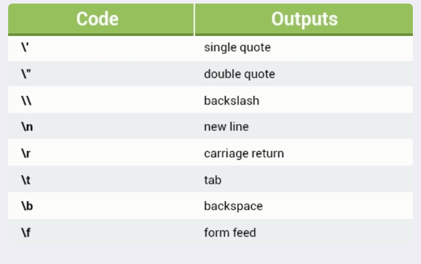

# APUNTES DE JAVASCRIPT **Clase1**

## Normas Lexicas

- Existe distincion entre MAYUS y minusculas

- La manera de marcar un comentario es la siguiente --> `/**/`

- por convencion las declaraciones de variables usaremos la convencion camel case--> `const camelCase = "camel case"`

- para constantes usaremos Mayusculas y guion bajo

- Hay palabras reservadas en Javascript:

  - `await break case catch class const continue debugger default delete do else export extends finally for function if import in instance of new return super switch this throw try type of var void while with yield`
  - y unas nuevas para futuro: `enum implements interface package private protected public`

- usaremos el semicolom `;` para que quede bonito

## VARIABLES

---

Hay dos tipos en Javascript: primitivos y objetos

- Primitivos: `numeros`, `string` y `booleans`. Tambien se considera `null` y `undefined`, pero son especiales. Los primitivos son **INMUTABLES** (no hay manera de cambiar su valor)

- Luego tendremos los Objects: todo lo que no sea un primitivo es un objeto. Son **MUTABLES**

- Se les llama tipos referenciales.

  - Objetos fundamentados `{}`
  - Array `[]`
  - `symbol`
  - Funciones
  - etc

## **Tipos de Variables**

- `const` : no se puede variar (constantes) no muta. Una buena practia es declararlas con MAYUS para diferenciar.
- `let` : puede variarse (Usaremos esta para el curso)

  - Es una variable de bloque. Es decir, que puede ser llamada solo en el lugar donde estan declaradas. Va por niveles. P.ej si declaro dentro de una funcion, solo la puedo llamar dentro de esta, sin embargo si esta declarada fuera de la funcion, podre llamarla en la funcion y fuera de ella.

- `var`: PROHIBIDO

- la variable se declara con sel simbolo `=` que significa **ASIGNACION** no igualdad.

- esto es un objeto con propiedad: propiedad:valor

      const o = {x : 1}

- Si declaramos una variable asi, lo estamos metiendo en el objeto global. Tampoco lo vamos a usar.

      x = 1

### **Tipo NUMBER**

Pueden ser numeros eneteros, decimales negativos o como queramos. Cuantos mas decimales mas le costará gestionarlo.

Asignar variables:

    let x = 87

    console.log(x)
    87

    //Cambio de variable

    x = 50

    console.log(x)
    50

### **Tipo TEXTO (String)**

- Son INMUTABLES
- Son como array de caracteres
- Hay dos formas de definir un string

  - Comillas simples `"string"`
  - Comillas simples ``string`

- los string son inmutables, no se cambian
- el primer caracter de un string es el 0

- dentro de un string podemos escapar cosas usando back slash `\`. salto de linea por:

      console.log("hola \"mundo\"")
      hola "mundo"
      console.log("hola \\")
      hola \

  Aqui dejo mas usos:
  

- Template string `$ {}` y se encierra entre ``.

  Todo lo que se escriba entre cada ${} aqui ${}, se vera representado en la consola. En este ejemplo al haber espacios, saldra separado por espacios.

      const name = "Alejandro";
      const firstQuote = "Mi nombre es";
      const lastQuote = "¿como estas?";

      console.log(firstQuote + " " + name + " " + lastQuote);

      // Esto es template string

      console.log(`${firstQuote} ${name} ${lastQuote}`);

- INVESTIGAR sobre `RegEx`!!!

### **Tipo BOOLEAN**

- Solo existen dos tipos literales.

  - `True`
  - `False`

NOTA: cualquier valor en JavaScript puede ser convertido en valor Booleano.

- 6 valores que funcionan como `False` de por si:

  `False`

  `undefined`

  `("") string vacio`

  `null`

  `NaN`

  `0`

- Si queremos saber que valor booleano es algo, escribiremos delante de el `!!`
- Hay 3 operadores booleanos importantes:

  - `&&` --> and
  - `||` --> or
  - `!` --> not

        - si `true` && `true`--> `true`
        - si `true` && `false`--> `false`
        - si `false` && `true`--> `false`
        - si `false` && `false`--> `false`

        - si `true` || `true`--> `true`
        - si `true` || `false`--> `true`
        - si `false` || `true`--> `true`
        - si `false` || `false`--> `false`

- El resto d evalores, numeros, string, array son `True`

- `Null`: es la ausencia de valor o ausencia de objeto. Tecnicamente es el unico miembro de su tipo.

- `undefined`: es ausencia de valor tambien, pero mas especial. Lo retorna cuando no se ha definido algo. Es el valor de

- Usaremos `==` para comparar los `null`y los `undefined`
  Para el resto de comparaciones usaremos `===`

### **Tipo Lista o ARRAY [ ]**

- En las listas Array el primer elemento del mismo siempre es el `0`

- No se pueden sumar ni restar ni multiplicar. Para hacerlo hay que llamar a los elementos que se encuentran dentro de esta de manera especifica.

- No estan ordenados

- la propiedad `.length` nos indica el numero de elementos que tiene.

- el ultimo elemento de una lista es el elemento `lista[lista.length-1]`

- Hay operaciones ya programadas para los array que se llaman `Metodos`

```
<script>

var nombre = "frabcesc";
var macedonia = ["poma","pera","33",nombre,true, ,"barcelona"];

//primer elemento
console.log(macedonia[0]);          //devuelve poma

//segundo elemento
console.log(macedonia[1]);          //devuelve pera

//ultimo elemento
console.log(macedonia[6]);         //devuelve barcelona
console.log(macedonia.length);     //devuelve el valor 7

console.log(macedonia[macedonia.length-1]) //devuelve barcelona

</script>

```

---

### **Objeto global**

- es un objeto fundamental
- las propiedades de este sirven como propiedades globales
- undefinec es una propiedad del objeto global

### **Symbol**

- Pueden ser propiedades de objetos

---

## TIPS

- **Programacion orientada a objetos:** en vez de definir funciones que operan sobre los distintos tipos, definimos tipos en si mismo que contienen funciones para trabajar con esos valores

- En programacion la referenciamos el primer caracter de un string con el numero `0` en vez de con 1

- Javascript tiene un recolector de basura

- archivos .json: JavaScript Object Notation.
