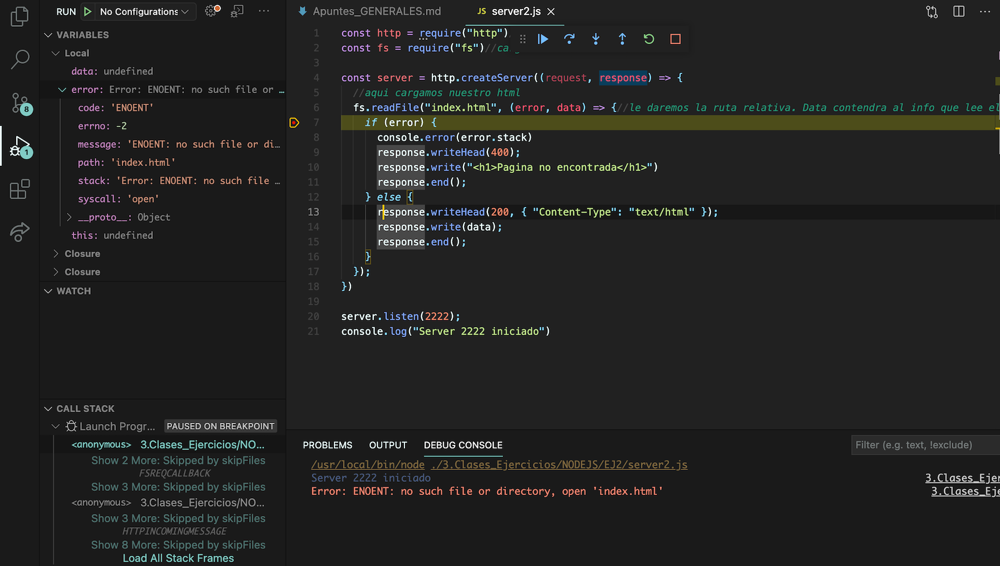
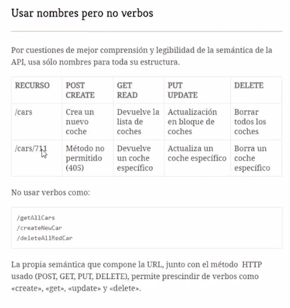
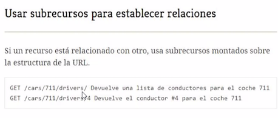

# Node.js

Se puede escribir Node en varios lenguajes, pero el mas comun es Node.

Es una plataforma de desarrollo de aplicaciones, es de codigo abierto.

Es JavaScript en el servidor lo describirian algunos. Lo vamos a utilizar para realizar aplicaciones de servidor. Aunq ue se puede hacer de todo. Nos vamps a centrar en APIs y app de servidor.

Desde node se pueden acceder a ciertas funcionalidades de tu ordenador, desde terminal de node.

### **Instalar Node**

Descargamos Node, la version LTS que es la que mejor soporte tiene. Se suele actualizar la version segun tu proyecto.

- https://nodejs.org/es/

- Se abre la consola y se escribe `node`
- control+c y control+c

## **Que es una API**

Mas info en apuntes "Apuntes_GENERALES"

[Documentacion de NODEJS](https://nodejs.org/dist/latest-v14.x/docs/api/)

Es basicamente documentacion de software. Es documentacion de una aplicacion.Es una colección de metodos.

## **Que es una API REST**

Es basicamente lo mismo, pero enfocado a la web y enfocado al protocolo `http`. Es una aplicacion de servidor del lado de backend.

Tienen metodos, que son los verbos de lo que hace esa llamada/accion a la API

Es basicamente: `Una direccion, con su puerto y todo, al que le haces una llamada y te devuelve un objeto JSON.`

Por ejemplo PokeAPI--> https://pokeapi.co/

Por ejemplo API Breaking Bad--> https://breakingbadapi.com/

Por ejemplo API de cervezas--> https://punkapi.com/documentation/v2

## **Que es SWAGGER?**

[Pagina de Swagger](https://swagger.io/)

[Documentacion--> UTIL!!](https://swagger.io/docs/specification/about/)

[SwaggerHub](https://app.swaggerhub.com/home)

Swagger es un framework para **documentar** APIs Rest desde muy diferentes fuentes: Archivos de configuración, XML, C#, Javascript, Ruby, PHP, Java, Scala… además existen multitud de módulos que te pueden ayudar a integrarlo en tu proyecto.

## **Que es POSTMAN**

[Descargar POSTMAN](https://www.google.com/search?q=postman&rlz=1C5CHFA_enES922ES922&oq=postman&aqs=chrome.0.69i59j0i20i263j0i395l3j69i60l3.1160j1j7&sourceid=chrome&ie=UTF-8)

En definitiva, en vez de estar en navegador testeando los recursos de nuestra api, lo realizamos desde aqui. Podemos testear metodos GET, POST, DELETE etc.

Postman es una herramienta que se utiliza, sobre todo, para el testing de API REST, aunque también admite otras funcionalidades que se salen de lo que engloba el testing de este tipo de sistemas.

Gracias a esta herramienta, además de testear, consumir y depurar API REST, podremos monitorizarlas, escribir pruebas automatizadas para ellas, documentarlas, mockearlas, simularlas, etc

https://openwebinars.net/blog/que-es-postman/

### **Métodos**

[Metodos de peticion de HTTP](https://developer.mozilla.org/es/docs/Web/HTTP/Methods)

Los mas conocidos:

Es muy común utilizar solo GET y POST

- `GET`: Pedir informacion (MAS UTILIZADOS)
- `HEAD`:
- `POST`:Enviar informacion (MAS UTILIZADOS)
- `PUT`: Actualizar o reemplazar informacion. Por ejemplo actualizar una base de datos.
- `DELETE`: Eliminar un recurso

### **Codigos de estado**

[Codigos de estado](https://developer.mozilla.org/es/docs/Web/HTTP/Status)

1. Respuestas informativas (100–199),
2. Respuestas satisfactorias (200–299),
3. Redirecciones (300–399),
4. Errores de los clientes (400–499),
5. errores de los servidores (500–599).

[Mensajes HTTP](https://developer.mozilla.org/es/docs/Web/HTTP/Messages)

## **Apuntes de primeros ejercicios NODEJS_Clase1**

- El ejercicio `server1.js` esta el primer ejercicio de levantar un servidor. Nuestra primera aplicacion en node.

  - Se arranca un servidor en consola con `$ node server1.js` y se para con **`control + c`**.

    - Requerimos el modulo `http`.

    - Requerimos el modulo `fs` que necesitaremos mas adelante.

    - Creamos el servidor con `http.createServer()`.

    - Hacemos que el server escuche el host y el port con `server.listen()`

- `server2.js`: En este ejercicio en vez de escribir nosotros el html, lo hemos referenciado con `fs.readFile()`

  - Hay veces que dara error, en los redFile() tenemos que indicar que sucede cuando da un error, ya sea o un mensaje como en nuestra app, o redirijirnos a otra pagina usando otra vez el readFile().

- `server3.js`: En este archivo hemos usado una ruta dinamica para cambiar sobre la marcha. MUY INTERESANTE e importante

- Los servidores requieren de recarga siempre para volver a reflejar los cambios, igual que las paginas web.

- Las aplicaciones tienen que ser robustas. Siempre tenemos que dar una respuesta a cada situacion posible, errores o cualquier cosa. Se cae un servidor, por ejemplo, debemos dar una respuesta a ese posible error.

- Los LOG de errores son super UTILES. PERDERLES EL MIEDO :)

## Debuggear en el servidor con NODE

Usaremos de momento la de VSCode. damos a `Run and Debug` y elegiremos el entorno en el que vamos a correr. Node.js (legacy).

Podemos dar puntos de ruptura (break points), que son esos puntos rojos en el codigo que se marcan en la parte de la izquierda al lado del numero de las filas

Una vez se ejecuta el Debugger, con esos puntos de rutura, se para y se congela y se puede ver los valores que tiene cada cosa en ese momento y punto especifico.

IMPORTANTE: Donde este el break point, esa linea no esta ejecutada,esta congelada, se espera a pasar a la siguiente.

El orden que seguira el Debugger con cada linea sera uno especifico de JS, es decirme si se encuentra una funcion asincrona, la pasara y la ejecutara cuando la termine.

Se utiliza el debug para pararnos en nuestro codigo y ver que valen las cosas en cada momento. Ver que datos reales estan usando y poder usarlos.



## Eventos Metodos etc

- `require()`:Importar un modulo ya preestablecido. El modulo "http" da muchas opciones, como crear un "Web Service".

  Otro modulo por ejemplo es "fs"(file system).

  ```js
  const http = require("http");
  const fs = require("fs");
  ```

- `http.createServer((request, response) => {})`: creamos nuestro servidor, con dos parametros como argumentos. Todas las APIS tienen estos parametros. Lo que pedimos al servidor `(request)` y lo que enviamos segun la peticion `(response)` (HEADERS, Codigos etc).

  Por ejemplo en la realidad seria una peticion de un formulario, una busqueda etc.

  - Una manera en la response es embeber todo nuestro html

  ```js
  const server = http.createServer((request, response) => {
    }
  ```

- `fs.readFile(path, (error, data) => {})`:Es un metodo de fs, para leer un documento.

  El path es una ruta real del servidor y comienza a nivel de el workspace y viene un callback, que se ejecuta cuando se termine de leer todo el fichero.

  Esta con 2 parametros, si todo va bien la info contenida del fichero estará en `data` y `error` sera null. Por otro lado si algo ha ido mal, `data` sera undefined y `error` hara lo que le indiquemos.

  ```js
  fs.readFile(path, (error, data) => {

  }
  ```

- `fs.writeFile(fileName, textoEscribir, function (error))`:crea y escribe un fichero. Si esta creado lo sobreescribe!!:

  ```js
  fs.writeFile("text.txt", "Soy la primera linea, Hola!", (error) => {
    if (error) {
      console.error("algo ha ido mal y no se ha podido escribir en el fichero");
    } else {
      console.log("fichero escrito correctamente");
    }
  });
  ```

- `fs.appendFile(fileName, textoEscribir, function (error))`:si queremos que vaya añadiendo cosas al fichero, se usa appendFile(). Si no esta creado el archivo, lo crea tambien

  ```js
  fs.writeFile("text.txt", "Soy la primera linea, Hola!", (error) => {
    //crea y escribe un fichero. Si esta creado lo sobreescribe!!
    if (error) {
      console.error("algo ha ido mal y no se ha podido escribir en el fichero");
    } else {
      console.log("fichero escrito correctamente");
    }
  });
  ```

- `server.listen()`:Es un metodo del modulo "http"

  ```js
  //aqui creara un puerto en la IP localhost como defined(127.0.0.1:1111)
  server.listen(3333);

  //ó dando un puerto y una IP
  server.listen(port, host, () => {
    console.log(`Servidor corriendo en http://${host}:${port}`);
  });
  ```

- La manera de hacer que nuestra pagina sea dinamica y nos cargue cualquier tipo de recurso(.js, .html, .css, .jpg etc), cambiando el `"Content-Type"`

  [Tipos de "Content-Type"](https://developer.mozilla.org/es/docs/Web/HTTP/Basics_of_HTTP/MIME_types)

  Se saca la extension y segun esta, le aplicamos un content type distinto ademas de indicarle la ruta donde tenemos guardados ese tipo de archivos:

  ```js
  //se mete dentro del const server

  let contentType;
  let path;

  let extension = request.url.split(".")[1];

  switch (extension) {
    case "html":
      contentType = "text/html";
      path = `./public/html${request.url}`;
      break;
    case "css":
      contentType = "text/css";
      path = `./public/css${request.url}`;
      break;
    case "js":
      contentType = "text/javascript";
      path = `./public/js${request.url}`;
      break;
    default:
      path = "";
      contentType = "";
  }
  ```

## Exportar e Importar Modulos

Se pued eexportar modulos o funciones que creemos en otros ficheros, de la misma manera que estan hechos los modulos `http` o `fs`.

Se usa `module.exports.variable`

En un archivo `calculadora.js`:

```js
module.exports.suma = (primero, segundo) => primero + segundo;
```

En otro archivo `server.js` la llamamos:

```js
const calculadora = require("./calculadora");

console.log(calculadora.suma(2, 3));
```

## **Empezar a crear nuestra API**

**NOTA: NO SE SUBEN LAS DEPENDENCIAS A GITHUB**

APUNTES de ejercicio--> /Users/alesortiz/Desktop/NEOLAND/FULL-STACK_NEOLAND/3.Clases_Ejercicios/NODEJS/NODEJS_Clase4/EJ3)

- iniciamos en consola con `npm init`

- damos los datos que nos piden y con esto creamos un fichero para nuestra API, `package.json`

- Ahora creamos nuestra API creando el archivo `api.js`. Se va a crear con `express.js`. de la misma manera que llamamos modulos de http o fs.

- Se crea el `endpoint`

- express es un modulo super popular, pero no viene preinstalado en node. Hay que instralarlo con `npm install express`. Al instalarlo se nos crearan dependencias en nuestro proyecto, en nuestro `package.json`:

  ```js
    {
      "name": "api-pokemon",
      "version": "1.0.0",
      "description": "Esto es una API de Pokemon",
      "main": "api.js",
      "scripts": {
        "test": "echo \"Error: no test specified\" && exit 1"
      },
      "author": "Alejandro Ortiz",
      "license": "ISC",
      "dependencies": { //estas son las creadas. Son los modulos que instalamos que no viene por defecto.
        "express": "^4.17.1"
      }
    }

  ```

- **NOTA**: Si por algun casual se desinstala node modules o nos descargamos un repo que no esta incluido en el, ya que no se suben a los repos, solo tendremos que descargarnos el pacjage.json y en consola hacer un `npm install`

- **BBDD**: El hacer una base de datos plana a traves de una constante en javascript, un archivo .js, no nos va a servir al realizar modificaciones en la misma. Cuando el servidor de node realice cambios en esa bbdd los realizara en la constante en el tiempo de ejecucion, pero una vez reiniciemos el servidor, la constante (codigo fuente) no habra sufrido ningun cambio.

  Por eso es bueno realizar los cambios en un archivo plano, por ejemplo un archivo .json en un array. De la misma manera que en un log.

- Metodo `GET`:

  Ejemplo de uso:
  /Users/alesortiz/Desktop/NEOLAND/PROYECTOS/neoland_exercises_nodejs/PokeAPI

  - Creamos nuestros primeros datos a meter en la API, en un archivo en .js, llamandolo de la misma manera que haciamos con los modulos(`require()`).

    Es decir, nos creamos un modulo con el objeto pokemon y nuestros pokemon, despues desde nuestro js, invocamos el modulo y lo llamamos:

    api.js:

    ```js
    //Esta es la estructura basica y muy utilizada

    const express = require("express"); //llamamos al modulo de express

    const app = express();
    //ó const api = express();

    const dbPokemon = require("./dbPokemon");

    app.get("/api/pokemon", (request, response) => {
      //creamos nuestro endpoing, al que alguien llamara y respondera con un JSON
      response.status(200).send({
        succes: true,
        message: "API pokemon",
        pokemon: dbPokemon.pokemon,
      });
    });

    app.listen(1009, () => {
      console.log("API corriendo en puerto 1009");
    });
    ```

    dbPokemon.js

    ```js
    const pokemon = [
      {
        id: 1,
        name: "Bulbasaur",
        type: "Planta",
      },
      {
        id: 4,
        name: "Squirtle",
        type: "Agua",
      },
      {
        id: 7,
        name: "Charmander",
        type: "Fuego",
      },
    ];

    module.exports = {
      pokemon: pokemon,
    };
    ```

- Metodo `POST`:

  Ejemplo de uso:
  /Users/alesortiz/Desktop/NEOLAND/PROYECTOS/neoland_exercises_nodejs/PokeAPI

  Es enviar informacion y añadir cosas a tu BBDD

- Metodo `DELETE`:

  Se trata de la misma manera que post, pero tendremos que crear la funcion para eliminar el que queremos y devolver la nueva informacion.

  Ejemplo de uso:
  /Users/alesortiz/Desktop/NEOLAND/PROYECTOS/neoland_exercises_nodejs/PokeAPI

- Metodo `GET ONE`:

  Conseguir uno en especifico, usando el metodo GET.

  Ejemplo de uso:
  /Users/alesortiz/Desktop/NEOLAND/PROYECTOS/neoland_exercises_nodejs/PokeAPI

- Metodo `PUT`:

  Se utiliza para actualizar o para añadir informacion.

  sacamos la informacion del elemento a actualizar mediante `params` y los datos a añadir o actualizar, a traves de `body`.

Buenas practicas a la hora de crear `endpoints`





## **Maneras de Enviar y Obtener informaciona la BBDD**

Hay varios metodos de POST y GET:

- **`query string`**: es mandar parametros directamente en la url con el POST.

  Se manda tu end point, seguido de una ?. Lo que hay despues son parametros y se añaden `key=value`/`clave=valor` seguido de `&`.

  Nuestra URL cambiara a la siguiente forma.

  http://127.0.0.1:5555/api/pokemon?name=pikachu&type=electrico

  Los datos vendran en la `request.query`

- Mandar a traves de **`body`**: En este metodo no se crean url, sino que va dentro del body.

  Usaremos el formato `x-www-for-urlencoded`.

  Para usar este metodo, tendremos que requerir el modulo `body-parser` de node que sirve para decodificar nuestros datos, ya que vienen encriptados.

  Accedemos a traves de `request.body`

  Ejemplo de configuracion al usar `body` para POST:

  ```js
  const express = require("express");
  const fs = require("fs");

  const bodyParser = require("body-parser");

  const api = express();

  //CONF DECODE BODYPARSER

  api.use(bodyParser.json()); //parseo a string
  api.use(bodyParser.urlencoded({ extended: true })); //decodifica info del body
  ```

- Mandar a traves de `params`:

  Accedemos a traves de `request.params`

  Se manda la llamada a traves de la url indicando el valor en la proipia url, indicandosela al final del `endpoint`. Por ejemplo:

  ```js
  api.get("/api/pokemons/:id", (request, response) => {
  console.log("como consigo el id?");}

  ```

  En este caso, llamaremos la url indicando el id en la url:
  `http://127.0.0.1:5555/api/pokemons/1` que nos traera el pokemon con el id 1.

## **Paginacion**

Es como un filtrado de la base de datos, para que no te traiga toda entera. Es como las paginas de internet donde tienes que ir cambiando de pagina.

- Paginado con `limit` y `offset`: Por ejemplo, en la api de pokemon, usaremos los elementos `pokemon?limit=100&offset=200`:

  - `limit`: nos dice el numero de elementos a mostrar

  - `offset`: nos trae los alementos a partir de este numero.

    `https://pokeapi.co/api/v2/pokemon?limit=100&offset=200`

  Se realizaria a traves de llamadas query string (mejor) o por body.

- Paginado por parametros:

  ```js
  api.get("/api/pokemons/page/:page", (request, response) => {});
  ```

  Suele resolverse con un slice(), de la siguiente manera:

  ```js
  const groupPokemon = allPokemon.slice(
    Math.abs(request.params.page) * PAGE_SIZE - PAGE_SIZE,
    Math.abs(request.params.page) * PAGE_SIZE
  );
  ```

### **Uso de FETCH**

https://developer.mozilla.org/es/docs/Web/API/Fetch_API/Utilizando_Fetch

- Basicamente, realiza una llamada a cualquier recurso http.

- Como realizar un `fetch`. Se realiza la peticion, con el servidor levantado, y nos devolvera una promesa, al que le tendremos que hacer `.then()` y `.catch()` correspondientes.

- a Este fetch, debemos convwertirlo en json par apoder tratarlo y en el siguiente then, nos vendra en la informacion en data. Con ese data podremos trabajar con ella:

  EJEMPLO:

  ```js
  const opts = {
    method: "GET",
    headers: { "Content-Type": "application/json" },
  };
  const cursList = fetch("url", opts)
    .then(function (response) {
      console.log("API RESPONSE SUCCESS");
      return response.json();
    })
    .then(function (data) {
      console.log(data);
    })
    .catch(function (err) {
      console.error(err);
    });
  ```

  Fetch a pokeapi:

  ```js
  const response = await fetch(
    "https://pokeapi.co/api/v2/pokemon?limit=151&offset=0"
  );
  //undefined
  const data = await response.json();
  //undefined
  data;
  //{count: 1118, next: "https://pokeapi.co/api/v2/pokemon?offset=151&limit=151", previous: null, results: Array(151)}
  const pokemon = data.results;
  //undefined
  pokemon;
  //(151) [arrays]
  ```

## **Levantar Web Service conb EXPRESS**

Una manera muy utilizada en vez de usar los switch etc para levantar un web service es usando expres. Abajo el ejemplo y las tres formas:

En todos ellos utilizaremos `__dirname` --> Es la raiz de nuestro servidor.

Esto son `midleware`:

- `FORMA 1`: ficheros estaticos en una subcarpeta especifica

  ```js
  //esto es una funcion midleware para servir ficheros estaticos
  app.use(express.static(__dirname + "/public"));
  //hacemos una llamada a todo lo contenido en public
  //se pueden hacer tantas llamadas al midleware como queramos
  ```

- `FORMA 2`: cargar un fichero especifico sin darle toda la url.

  ```js
  // crearemos uno especifico para html sin que muestre toda la url:

  app.use(express.static(__dirname + "/public/html", { extensions: ["html"] })); //hacemos una llamada a todo lo contenido en public
  app.use(express.static(__dirname + "/public", { extensions: ["html"] })); //hacemos una llamada a todo lo contenido en public
  ```

- `FORMA 3`:

  ```js
  //cargar paginas sin necesidad de especificarle la url
  //esta manera le dices que todos tus js estan en la carpeta y que tienen ese content type. Te lo gestiona.
  app.use(
    "/js",
    express.static(path.join(__dirname + "public/js"), { "content-type": "js" })
  );
  app.use(
    "/css",
    express.static(path.join(__dirname + "public/css"), {
      "content-type": "css",
    })
  );

  //IMPORTANTE: llamamos al css/js para que vaya a esa raiz, todo lo que empiece con ese prefijo, llamalo desde aqui. En el lado que se haga la llamada tendra que empezar por ahi
  ```

# CORS (Cross-Origin Resource Sharing)

https://developer.mozilla.org/en-US/docs/Glossary/CORS
https://developer.mozilla.org/en-US/docs/Glossary/preflight_request

Es comparticion de recursos cruzado entre distintos servidores.

Por defecto, las APIs son privadas y requieren de una configuracion para dar permisos para que alguien pueda acceder a ella en el momento que requiera. De esta manera, ya se pueden realizar peticiones a la pagina. La configuracion mas abajo:

Se inserta en la api (api.js) justo despues de inicializar express.

```js
// CONFIGURACION: CORS
app.use((req, res, next) => {
  res.header("Access-Control-Allow-Origin", "*");
  // authorized headers for preflight requests
  // https://developer.mozilla.org/en-US/docs/Glossary/preflight_request
  res.header(
    "Access-Control-Allow-Headers",
    "Origin, X-Requested-With, Content-Type, Accept"
  );
  next();
  app.options("*", (req, res) => {
    // allowed XHR methods
    res.header(
      "Access-Control-Allow-Methods",
      "GET, PATCH, PUT, POST, DELETE, OPTIONS"
    );
    res.send();
  });
});
```
