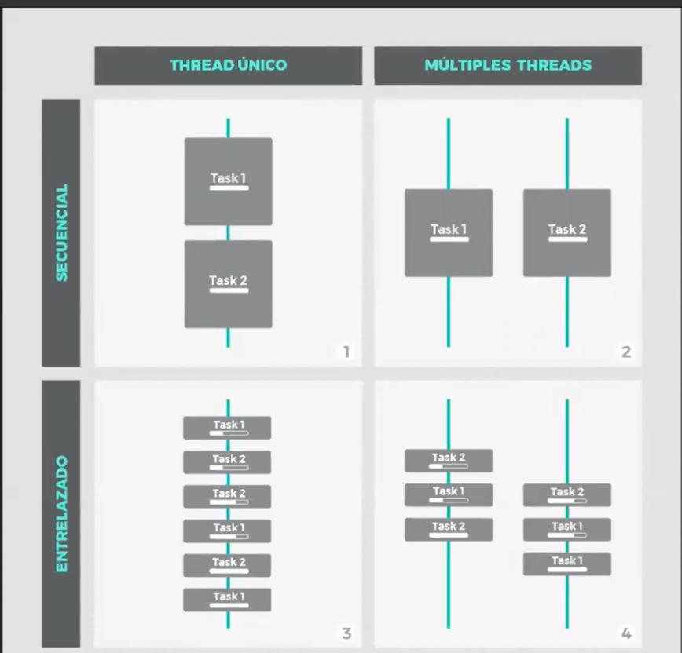
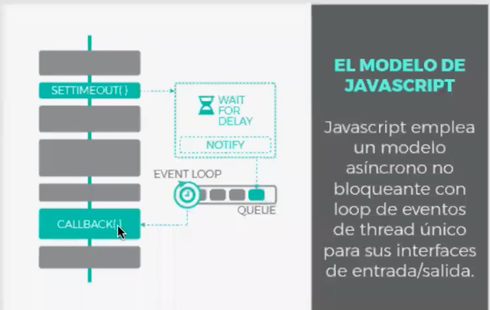
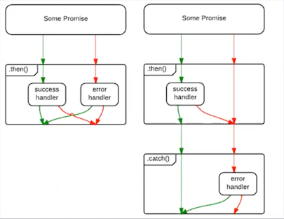

# Apuntes JavaScript Clase 2

## Estamentos

## Condicionales **`if & else`**

- El orden logico de ejecucion del estamento es desde `arriba hacia abajo`.

- el estamento `if` es el estamento mas basico y tiene dos formas, pero solo usaremos una forma:

```
if (condition is true) {
  statement is executed
}

```

```js
if (username == null) {
  username = "Alejandro Ortiz";
}
```

```js
//el primer estamento se ejecuta si la primera condicion se cumple, sino , la segunda
if (expresion) {
  estamento1;
} else {
  estamento2;
}
```

```js
if (i === j) {
  if (j === k) {
    console.log("i es igual a j");
  }
} else {
  console.log("i es igual a j");
}
```

EJEMPLO:

```js
if (n === 1) {
  //pasan cosas
} else if (n === 2) {
  //pasan mas cosas
} else if (n === 3) {
  //siguen pasando mas cosas
} else {
  // si todo lo anterior falla, pasa esto
}

//tambien podemos escribirlo asi

if (n === 1) {
  //pasan cosas
} else {
  if (n === 2) {
    //pasan mas cosas
  } else {
    if (n === 3) {
      //siguen pasando mas cosas
    } else {
      // si todo lo anterior falla, pasa esto
    }
  }
}
```

- Una manera BUENA de escribir codigo es el TDD o Test Driven Development. Consiste en testear cada paso que hacemos hasta que salga bien, y despue spasamos al siguiente. IMPORTANTE!!

  - Una manera es usar `console.assert`, que te indica si un estamento o condicion se cumple. Si se cumple, no dara nada, si no se cumple dara ERROR

  ```js
  function testSize(num) {
    if (num < 5) {
      return "Tiny";
    } else if (num < 10) {
      return "Small";
    } else if (num < 15) {
      return "Medium";
    } else if (num < 20) {
      return "Large";
    } else if (num >= 20) {
      return "Huge";
    }
    return "Change me";
  }
  console.assert(testSize(4) === "Tiny");
  console.assert(testSize(9) === "Small");
  console.assert(testSize(14) === "Medium");
  console.assert(testSize(19) === "Large");
  console.assert(testSize(20) === "Huge");
  ```

- Otra manera d ehacer condicionales es usando `switch(n)`. No vale para comparaciones.

```js
switch (n) {
  case 1: //empieza aqui si n === 1
    console.log("Es igual a 1"); //pasan cosas
    break; //para aqui

  case 2:
    console.log("Es igual a 2"); //pasan cosas
    break; //para aqui

  default:
    //ocurre todo lo demas
    break; //aquaba aqui
}

//usar el break es obligatorio
```

Tambien se puede agrupar de esta manera

```js
switch (n) {
  case 1:
  case 2:
    result = "1 y 2";
    break;

  case 3:
    result "es 3";
    break;

  default:
    //ocurre todo lo demas
    break; //aquaba aqui
}
```

- Otro `ejemplo` podria ser el siguiente:

```js
function convert(x) {
  if (typeof x === "number") {
    return x.toString(16);
  } else if (typeof x === "string") {
    return `"${x}"`;
  } else {
    return String(x);
  }
}

//es lo mismo que:

function convert(x) {
  switch (typeof x) {
    case "number":
      return x.toString(16);
    case "string":
      return `"${x}"`;
    default:
      return String(x);
  }
}
```

- Test Driven Development (TDD): Es una manera de trabajar comprobando cada paso que vamos realizando en nuestro codigo mediante test.

  **Forma 1 de TDD**

  - Se puede hacer con `console.assert()` . Si esta todo bien, no te dira nada. Si hay fallo, te dara un error:

    ```js
    function testSize(num) {
      if (num < 5) {
        return "Tiny";
      } else if (num < 20) {
        return "Small";
      } else if (num >= 20) {
        return "Huge";
      }
      return "Change me";
    }
    console.assert(testSize(4) === "Tiny");
    console.assert(testSize(9) === "Small");
    console.assert(testSize(20) === "Huge");
    ```

  - **NOTA**: Los ejemplos que hagamos en el test tienen que ser reales. No vale con poner la misma formula o estamenbto de la funcion. Ponemos valores de entrada y despues los valores de salida que se esperan

  **Forma 2 de TDD**

  - Tambien se puede hacer con una libreria Jasmine y usando varios archivos.

    1. Se abre primero el .html SpecRunner en el navegador y despues los archivos `*.js` y `*.spec.js`

    2. Comenzamos la funcion `describe()` (es una mera descripcion)para que nos muestre en pantalla en el _.spec.js y en nuestro _.js añadiremos nuestra funcion

    3. Los Test, Se hacen con EJEMPLOS CONCRETOS , Nada de funciones, variables ni nada.`OJO`

    4. Puedes hacer tantos Test como quieras dentro de los `it`. Es decir, tantos `expect()` (Lo que esperamos que pase) seguido de `.toEqual` (matcher) ,como queramos.

    5. Los Test tienen tres partes:

       1. Preparación (Arrange)
       2. Ejecución (Act)
       3. Asertación (Assert)

    6. Hay varios tipos de "Matchers" en Jasmine para comparas lo que realmente queramos. [Link a Documentacion](https://jasmine.github.io/api/3.6/matchers.html)

    7. `Jasmine` se instala a traves de npm

       EJEMPLO 1:

       ```js
       //*.js
       function chainToSwitch(val) {
         switch (val) {
           case "Bob":
             return "Marley";
           case 42:
             return "answer";
           case 1:
             return "There is no #1";
         }
       }

       //*.spec.js Para hacer los test

       describe("chainToSwitch", () => {
         it("Retorna 'Marley' en caso de 'Bob'", () => {
           expect(chainToSwitch("Bob")).toEqual("Marley");
         });

         it("Retorna 'answer' en caso de 42", () => {
           expect(chainToSwitch(42)).toEqual("answer");
         });

         it("Retorna 'Tere is no #1' en caso de 1", () => {
           expect(chainToSwitch(1)).toEqual("There is no #1");
         });
       });
       ```

## Bucles (loop) **`for/ while/ do...while/ for...of/ for...in `**

El uso mas comun de los loops es iterar sobre un array. Pasa por todos los elementos de un array.

Hay mucha smaneras de hacer loops.

- `while`: es el estamento mas basico de javascript

  ```js
  inicializacion;

  while (test) estamento;
  actualizacion;

  //

  while (expresion) {
    estamento;
  }
  ```

  Si la expresion es cierta --> se ejecuta el estamento.
  Si es falsa, directamente pasa al siguiente.

  Cada vuelta que da se llama iteracion.

  Ejemplo 1:

  ```js
  let count = 0;
  while (count < 10) {
    //mientras pase esto
    console.log(count); //haz esto
    count++; //despues esto
  }
  //ira pasando todos los numeros desde 0 hasta que llegue a 10, que parara. Ira sumando uno con cada iteracion
  ```

- `do...while`:NO SE USA

- `for`

  ```js
    for (inicializacion; condicion; actualizacion) {
      estamentos;
    }
  }
  ```

  ```js
  for (let count = 0; count < 10; count++) {
    console.log(count);
  }
  //Es lo mismo q ue los while pero de otra forma
  //1 inicializacion,2 testeo,3 estamento y 4 actualizacion
  ```

  Si separamos por comas (`,`)

  ```js
  //se pueden concatenar distintos estamentos separando con comas
  let sum = 0
  for (let i = 0, j = 10, sum = 0; i < 10; i++, j++){
  sum += i * j;
  console.log(sum);
  }

  let sum = 0
  for (let count = 0; count <= 5>;count++){
  sum += count;
  }

  ```

  - Existe una optimizacion para los `for` que se llama `recursividad`. Es decir, llamarse a si mismo.

    [Leer mas sobre Recursividad](https://portfoliostuff-parenttobias.codeanyapp.com/2020/01/29/recursion-all-the-way-down/)

    [Video de youtube](https://www.youtube.com/watch?v=yX5kR63Dpdw)

    Estos siempre deben tener un punto en el que se indique un final, para poder devolver un valor. Sino seria infinito. Ejemplo:

    ```js
      //devuelve la suma de los primeros n numero de un array
      function sum(arr, n) {
         if (n <= 0) {
          return 0;
        } else {
          return sum(arr, n - 1) + arr[n - 1];
        };
       };

        //O el factorial de un numero

      function factorial(num) {

      if (num <= 0) {
        return 1
        } else {
        return factorial(num - 1) \* (num);
        }
      }

    ```

- `for...of` : va recorriendo cada caracter, index de array de cada elemento iterable y hace algo que tu digas

  - Trabaja con objetos iterables, no solo con array. Cualquier cosa iterable (String, Array, etc).

  - No funciona con objetos

  - Aparecio en EcmaScript 6.

  ```js
  const data = [1, 2, 3, 4, 5, 6, 7, 8, 9];

  let sum = 0;

  for (let element of data) {
    sum += element;
  }

  //suma cada elemento de data. En este caso recorre cada index del array
  ```

  ```js
  const name = "Alex!";

  for (let character of name) {
    console.log(character);
  }

  //suma cada elemento de data. En este caso recorre cada index del array
  ```

  No funciona con Objetos IMP!. Podriamos trabajar con objetos usando `Object.values()` (devuelve los valores de la prop en un array) y `Object.keys()` (nos devuelve el nombre de la prop en un array).

  ```js
  const o = { x: 1, y: 2, z: 3 };
  let sum = 0;

  for (let prop of Object.keys(o)) {
    sum += o[prop];
  }

  //o

  const o = { x: 1, y: 2, z: 3 };
  let sum = 0;

  for (let value of Object.values(o)) {
    sum += values;
  }
  ```

- `for...in` :

  ```js
  const o = { x: 1, y: 2 };

  for (let p in o) {
    console.log(o[p]);
  }
  ```

  Es un estamento que recorre las partes de in objeto
  .

  ```js
  let perro = {
    nombre: "Lolo",
    patas: 4,
    raza: "Pastor Aleman",
  };

  function propObject(obj) {
    let prop = [];

    for (let property in obj) {
      prop.push(property);
    }
    return prop;
  }

  console.log(propObject(perro));
  ```

# **SINCRONIA**

La concurrencia y el Paralelismo estan relacionados pero tienen matices. Si se ejecutan y terminan primero una y despues otra, se llama Secuencial **(Modelo 1)**.

Modelos de Sincronia:


## Concurrencia

Es cuando dos o mas tareas progresan de manera simultanea. No en el mismo espacio de tiempo. Vas avanzando en cada una poquito a poco.

Seria el **modelo 3**

## Paralelismo

Cuando dos o mas tareas se ejecutan literalmente a la vez, en el mismo espacio de tiempo.

Seria el **modelo 4**

## Tareas (Task)

Hay tareas sincronas (o bloqueantes) o asincronas.

JavaScript utiliza un modelo `Asincrono y NO Bloqueante` o tambien llamado `Event loop`. Un loop de eventos en un unico hilo.



```js
setTimeout(() => console.log("he terminado"), 2000);
//ejecutara el call Back despues de 2000 ms

//Si ocurriera esto
let callBack = () => console.log("Esto deberia ir primero");

setTimeout(callBack, 0);

console.log("Primero!");

//incluso aunque sean 0 ms, iria despues que el otro proceso, ya que se pone a la cola despues del delay.
```

Mientras lanzamos el setTimeout, JS va realizando una serie de tareas. es de ir, empieza ejecutando ese codigo setTimeout, una vez acaba ese contador, pondra a la cola de evento el codigo que deseamos ejecutar.

`setTimeout()` es una funcion asincrona. Ejecutara el siguiente proceso antes que su propio call back.

Antes se trabajaba usando estos CALLBACK y los setTimeout, pero se hacia ingobernable poner uno detras de otro, ocurriendo el adouken, la piramide etc.

## **Promesas**

---

[Uso de promesas](https://developer.mozilla.org/en-US/docs/Web/JavaScript/Guide/Using_promises)

Esto se corrigio con las `Promesas` IMPORTANTE (en Python se llaman futuros)

- Las `Promesas` usan una funcion como argumento con dos parametros (resolve, reject):

```js
const myPromise = new Promise((resolve, reject) => {});
```

- Las promesas tienen 3 estados: `pending`, `fullfilled` y `reject`

- Debajo de ellas hay un callBack y son prioritarias al setTimeout.

- Para crear una promesa tenemos que llamar al `new Promise()`

```js
const promise = new Promise((resolve, reject) => {
  const number = Math.floor(Math.random() * 10);

  setTimeout(() => {
    return number > 5 ? resolve(number) : reject("menor de 5");
  }, 1000);
})
  .then((result) => console.log(result))
  .catch((error) => console.log(error));
```

- el `resolve` y `reject` son funciones.(INVESTIGAR)

  - `reject`: hace saltar al Error.

  - `resolve`:

- Usaremos el `.then()` para mostrar lo que pasa si sale bien/true y el `.catch()` para lo contrario.(INVESTIGAR)

  

  Ejemplo del funcionamiento de los dos:

  ```js
  //ejemplo 1
  let promise = request();

  promise.then(
    function (data) {
      console.log(data);
    },
    function (error) {
      console.error(error);
    }
  );

  //ejemplo 2
  let promise = request();

  promise
    .then(function (data) {
      console.log(data);
    })
    .catch(function (error) {
      console.error(error);
    });
  ```

  - `.then(fullfilled, rejected)`: nos traera el valor o lo que queramos y cuantas veces queramos (encadenando/bindeando tantos then como queramos) cuando el `resolve` se haya resuelto.

    Tambien puede actuar con el `reject` cuando haya tenido fin y se resuelva.

  - `.catch()`: nos traera el valor del reject cuando lo encadenamos despues de un then. Es ejecutado inmediatamente despues de que el metodo `reject` es llamado

    ```js

    //Con el .catch te ahorras parte del then.

    const promise = request();

    promise.catch((error) => {
      mostrarError(error);
    })

    //significan lo mismo las dos maneras

    promise.then(null, error) => {
      mostrarError(error)
    }
    ```

- **Cadena de Promesas**:

  Con ella snos aseguramos el orden de ejecucion de las promesas.

  Ejemplo claro:

  ```js
  function task1() {
    return new Promise((resolve, reject) => {
      setTimeout(() => {
        resolve("resultado de la task1");
      }, 5000);
    });
  }

  function task2() {
    return new Promise((resolve, reject) => {
      setTimeout(() => {
        resolve("resultado de la task2");
      }, 1000);
    });
  }

  const promise = task1();

  promise
    .then((data1) => {
      console.log("data1", data1);
      return task2(); //Si el resultado de un then es una promesa como aqui, siempre va a ser la promesa del siguiente then.
    })
    .then((data2) => {
      console.log("data2", data2);
      return "Hola Promesas";
    })
    .then((data3) => {
      console.log("data3", data3);
    });
  ```

  TRAMPAS y cosas a evitar con cadenas de promesas:

  - Queremos devolver el dato de una promesa pero en realidad no se manda:

    CUIDADO: hay veces que nos puede interesar que no nos devuelva el dato, por ejemplo al enviar un dato al servidor, no queremos que nos devuelva nada.

    ```js
    //esta funcion no devolvera el dato, sino la promesa de nuevo.
    function testPromise() {
      const promise = task();

      promise.then(data) => hazLoQueSea((data));

      return promise;
      }

    //Si queremos devolver el dato debemos hacer lo siguiente:

    function testPromiseWell() {
      return task().then((data) => hasLoQueSea(data))

    }
    ```

  - Puede que nos veamos tentados en anidar las tareas dentro de otras, pero para ello no hacemos cadenas, porque el resultado es la piramide del HORROR de nuevo:

    ```js
    //Esto NO
    function doom() {
      return task().then(() => {
        return task2().then(() => {
          return task3().then(() => {
            return task4().then(() => {
              hazLoQueSea();
            });
          });
        });
      });
    }

    //Esto SI
    function notDoom() {
      return task()
        .then(() => {
          return task2();
        })
        .then(() => {
          return task3();
        })
        .then(() => {
          return task4();
        })
        .then(() => {
          hazLoQueSea();
        });
    }
    ```

  - La promesa fantasma.

    REGLA:Cuando una funcion pueda retornar una promesa, siempre debe retornar esa promesa.

    ```js
    //Esto no devuelve una promesa, en un caso si en el otro no.
    function ghostPromise() {
      if (test) {
        return unaNuevaPromesa();
      } else {
        return "foo";
      }
    }
    const result = ghostPromise();
    if (
      typeof ghostPromise === "object" &&
      typeof ghostPromise.then === "function"
    ) {
    } else {
    }

    //En este caso hemos convertido el segundo caso en una Promesa auto resuelta. Es decir es como si se diera el resultado a si mismo.
    function notGhosting() {
      if (test) {
        return unaNuevaPromesa();
      } else {
        return Promise.resolve("foo");
      }
    }
    ```
