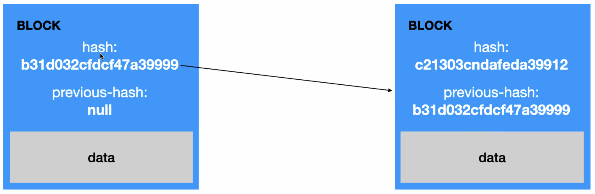

# DUDAS Y CONOCIMIENTOS GENERALES

## Lenguajes Compilados e Interpretados

## ¿Que es programacion Orientada a Objetos? ¿Programacion Funcional? ¿Diferencias?

## **¿Que es una API?**

## **¿Que es un Array?**

## **¿Que es npm?**

Dentro de Node, el código se organiza por módulos o paquetes, así que al momento de trabajar con él va a ser necesario agregar más módulos, es aquí donde entra npm.

Node Package Manager o simplemente `npm` es un gestor de paquetes, el cual hará más fáciles nuestras vidas al momento de trabajar con Node, ya que gracias a él podremos tener cualquier librería disponible con solo una línea de código, npm nos ayudará a administrar nuestros módulos, distribuir paquetes y agregar dependencias de una manera sencilla.

---

## **Que es Node.js?**

Es un motor/entorno de ejecucion de JavaScript. Traduce lo que escribimos para que el ordenador entienda lo que tiene que hacer.

- <https://nodejs.org/es/about/>

- Node.js es un entorno JavaScript de lado de servidor que utiliza un modelo asíncrono y dirigido por eventos.

- Es una Máquina Virtual tremendamente rápida y de gran calidad escrita por gente como Lars Bak, uno de los mejores ingenieros del mundo especializados en VMs(Virtual Machines). No olvidemos que V8 es actualizado constantemente y es uno de los intérpretes más rápidos que puedan existir en la actualidad para cualquier lenguaje dinámico. Además las capacidades de Node.js para I/O (Entrada/Salida) son realmente ligeras y potentes, dando al desarrollador la posibilidad de utilizar a tope la I/O del sistema.

- Node soporta protocolos TCP, DNS y HTTP. Y fue creado por Ryan Dahl en 2009 y su evolución está apadrinada por la empresa Joyent que además tiene contratado a Dahl.

- Uno de los puntos fuertes de Node.js es su capacidad de mantener muchas conexiones abiertas y esperando. En Apache por ejemplo el parámetro MaxClients por defecto es 256. Este valor puede ser aumentado para servir contenido estático, sin embargo si se sirven aplicaciones web dinámicas en PHP u otro lenguaje es probable que al poner un valor alto el servidor se quede bloqueado ante muchas conexiones esto dependerá del trabajo que la aplicación web de lado del servidor y de su capacidad hardware.

---

## **Taller de introducciona JavaScript - Crea tu propia criptomoneda**

---

- Distintas RRSS
  - Youtube: 10 minutos de programando
  - linkedin: mariogiron
  - twitter: m_giron

### **Blockchain**

Cadena de bloques que estan encadenados entre si. Estos bloques almacenan informacion. Se puede enfocar a criptomonedas pero tambien para muchas otras cosas.

Son cadenas de datos, en las que cada una esta referenciada con un ID o "hash" unico. Este hash se crea con la encriptacion de los datos que contiene.  
Tambien algo muy importante es que cada Block hace referencia a un "previous-hash" que referencia al hash del bloque anterior.

- Programacion orientada a objetos: es programacion, un paradigma que intenta crrar cosas que existen en la vida real, a codigo. Acciones, etc  
  Importancia del metodo constructor.

- <https://repl.it> : una pagina para instalar librerias y mas cosas. Crea entorno de desarrollo.
